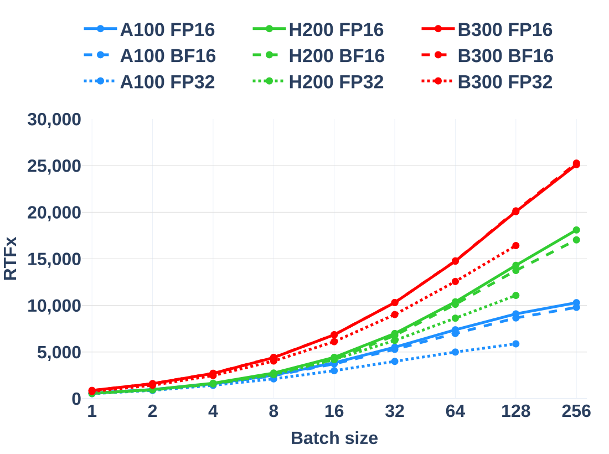
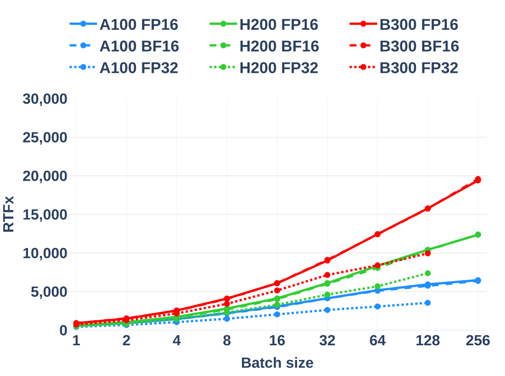

# Fast GPU ASR

[](https://github.com/SoundsGoodAI/fast-gpu-asr/actions/workflows/ci.yml)
[](https://pypi.org/project/fast-gpu-asr/)
[](pyproject.toml)
[](#quick-start)
[](src/fast_gpu_asr/py.typed)
[](https://github.com/astral-sh/ruff)
[](LICENSE)

**Zipformer and Parakeet. Built for speed.**

Batched offline speech recognition for NVIDIA GPUs. Raw audio in, text and word
timestamps out, through one Python API. TensorRT engines, native CUDA plugins,
and GPU beam search handle inference; no NeMo or K2 installation is needed.

<!-- benchmark-results:start -->

## Batched speech recognition at up to 25,000 RTFx on B300

<table>
  <tbody>
    <tr>
      <th width="100%"><div align="center"><big>Zipformer CR-CTC-transducer (decoder beam 6)</big></div></th>
    </tr>
    <tr>
      <td width="100%"><a href="docs/benchmarks/zipformer-fp16-bf16-fp32.svg"></a></td>
    </tr>
    <tr>
      <th width="100%"><div align="center"><big>Parakeet V3 (decoder beam 6)</big></div></th>
    </tr>
    <tr>
      <td width="100%"><a href="docs/benchmarks/parakeet-fp16-bf16-fp32.svg"></a></td>
    </tr>
  </tbody>
</table>

**RTFx** = total audio duration / total inference time: throughput, not request latency.

**FP16, decoder beam 6:**

| GPU | Model | Batch 1<br>RTFx | Batch 256<br>RTFx | Batch 1<br>Suite time | Batch 256<br>Suite time | Batch 1<br>Mean WER | Batch 256<br>Mean WER |
|---|---|---:|---:|---:|---:|---:|---:|
| A100 | [Zipformer CR-CTC-transducer](docs/benchmarks/results.md#a100) | 589.0 | 10,298.5 | 964.35 s | 55.15 s | 5.254% | 5.259% |
| A100 | [Parakeet V3](docs/benchmarks/results.md#a100) | 560.8 | 6,482.0 | 1012.79 s | 87.62 s | 4.824% | 4.816% |
| H200 | [Zipformer CR-CTC-transducer](docs/benchmarks/results.md#h200) | 578.2 | 18,100.2 | 982.29 s | 31.38 s | 5.254% | 5.260% |
| H200 | [Parakeet V3](docs/benchmarks/results.md#h200) | 593.6 | 12,352.7 | 956.80 s | 45.98 s | 4.803% | 4.804% |
| B300 | [Zipformer CR-CTC-transducer](docs/benchmarks/results.md#b300) | 879.8 | 25,108.6 | 645.57 s | 22.62 s | 5.257% | 5.261% |
| B300 | [Parakeet V3](docs/benchmarks/results.md#b300) | 897.5 | 19,398.7 | 632.82 s | 29.28 s | 4.814% | 4.810% |

We reproduced the [Open ASR Leaderboard](https://github.com/huggingface/open_asr_leaderboard) English evaluation with fast-gpu-asr, using its datasets and WER scorer and reporting both **RTFx and WER**. [Methodology](docs/benchmarks/methodology.md#timing-and-scoring).

### Key Observations

- **Batching matters.** On B300 with FP16, batch 256 versus batch 1 delivers 28.5x for Zipformer CR-CTC-transducer and 21.6x for Parakeet V3.
- **Gains taper.** On that same GPU with FP16, doubling capacity from 128 to 256 changes throughput by +25.1% for Zipformer CR-CTC-transducer and +23.0% for Parakeet V3.
- **BF16 is supported too.** At B300/batch 256, BF16 throughput is slightly higher for Zipformer CR-CTC-transducer and Parakeet V3 than FP16. WER is recorded for every configuration; precision can marginally change outputs.
- **FP16 vs. FP32.** At B300/batch 128, FP16 changes throughput by +22.2% for Zipformer CR-CTC-transducer and +58.5% for Parakeet V3 relative to FP32.
- **Mean-WER is consistent across precisions and batches.** On B300, the recorded mean-WER span across all measured precisions and batches is 0.014 percentage points for Zipformer CR-CTC-transducer and 0.034 percentage points for Parakeet V3.

[All results](docs/benchmarks/results.md) | [Download CSV](docs/benchmarks/measurements.csv)

<!-- benchmark-results:end -->

## Quick Start

**Requirements:** Linux x86-64, Python 3.12-3.14, an NVIDIA GPU, and
[NVIDIA driver 580 or newer](https://docs.nvidia.com/deploy/cuda-compatibility/minor-version-compatibility.html).
The package uses CUDA 13 and TensorRT `>=11.3.0.99,<12`.
The wheel includes all nine native plugins; no local plugin compilation or
TensorRT development headers are needed.

```bash
python -m pip install fast-gpu-asr
```

Choose a model below. Both examples export **FP16, beam 6, batch capacity 8**,
with a **0.1 / 8 / 40-second** minimum/typical/maximum audio profile. Checkpoints
are downloaded from each model's `main` branch and are not bundled with the package.

Build engines **on the GPU you will use**, with the same TensorRT/plugin stack
as inference. **Export deletes and recreates its output directory.** Keep
checkpoints and unrelated files outside it. Building engines takes time and
requires additional host/GPU memory for tactic selection.

### Zipformer CR-CTC-transducer

[Zipformer CR-CTC-transducer XL 290M](https://huggingface.co/soundsgoodai/Zipformer-cr-ctc-transducer-XL-290M)
checkpoint: **CC-BY-NC-4.0**.

```bash
mkdir -p checkpoints/zipformer
base=https://huggingface.co/soundsgoodai/Zipformer-cr-ctc-transducer-XL-290M/resolve/main
for file in model.pt config.yaml bpe.model; do
  curl --fail --location "$base/$file" --output "checkpoints/zipformer/$file"
done

fast-gpu-asr-export-zipformer \
  --model-path checkpoints/zipformer/model.pt --output-dir exported/zipformer \
  --batch-size 8 --decoder-type transducer_modified_beam_search --beam 6 \
  --encoder-precision fp16 --decoder-precision fp16 \
  --min-audio-seconds 0.1 --opt-audio-seconds 8 --max-audio-seconds 40 \
  --optimization-level 5
```

### Parakeet V3

[Parakeet TDT 0.6B V3](https://huggingface.co/nvidia/parakeet-tdt-0.6b-v3)
checkpoint: **CC-BY-4.0**, with attribution requirements.

```bash
mkdir -p checkpoints/parakeet
base=https://huggingface.co/nvidia/parakeet-tdt-0.6b-v3/resolve/main
curl --fail --location "$base/parakeet-tdt-0.6b-v3.nemo" \
  --output checkpoints/parakeet/parakeet-tdt-0.6b-v3.nemo

fast-gpu-asr-export-parakeet \
  --model-path checkpoints/parakeet/parakeet-tdt-0.6b-v3.nemo \
  --output-dir exported/parakeet --batch-size 8 \
  --decoder-type transducer_modified_beam_search --beam 6 \
  --encoder-precision fp16 --decoder-precision fp16 \
  --min-audio-seconds 0.1 --opt-audio-seconds 8 --max-audio-seconds 40 \
  --optimization-level 5
```

### Transcribe

Use either exported bundle with the same API. This example reads two mono PCM16
WAV files at 16 kHz, each no longer than 40 seconds:

```python
import wave

import numpy as np

from fast_gpu_asr import ASR

paths = ["sample-1.wav", "sample-2.wav"]
audios = []
for path in paths:
    with wave.open(path) as wav:
        if (wav.getnchannels(), wav.getsampwidth(), wav.getframerate()) != (1, 2, 16000):
            raise ValueError(f"Expected a mono PCM16 WAV at 16 kHz: {path}")
        samples = np.frombuffer(wav.readframes(wav.getnframes()), dtype="<i2")
    audios.append(samples.astype(np.float32) / 32768.0)

asr = ASR("exported/zipformer")  # Or "exported/parakeet".
texts, timestamps = asr(audios)
for path, text, words in zip(paths, texts, timestamps, strict=True):
    print(f"{path}: {text}")
    for word, start, end in words:
        print(f"  {start:.2f}-{end:.2f}: {word}")
```

Pass a nonempty list of nonempty, one-dimensional NumPy `float32` waveforms,
normalized to `[-1, 1]`, at the bundle's sample rate. **Partial batches work**:
you can pass fewer clips than the exported capacity, but not more. Each clip
must fit the maximum duration; short clips are padded internally while retaining
their valid lengths. Resample and segment longer recordings before calling `ASR`.

The return value contains one transcript and one list of `(word, start, end)`
tuples per input, with times in seconds. Word boundaries are derived from decoder
token times, not a separate forced aligner; the final word ends at the audio
duration. Select a GPU with `ASR(..., device_id=0)`.

## Why It Is Fast

The contribution is the inference pipeline: taking these trained architectures
from raw waveforms to batched transcripts without requiring their training stacks.

- **Features stay with the encoder.** Waveform framing, FFT, mel projection, and
  feature normalization run on the GPU inside the acoustic encoder engine.
- **Native operators where they matter.** Nine TensorRT plugins implement
  feature extraction, relative-attention operations, convolution, and Zipformer
  resampling/output assembly, using CUDA, cuFFT, and cuBLAS.
- **Search stays on the GPU.** Beam scores, hypothesis merging before pruning,
  and token histories stay in device memory. Parakeet's search also tracks
  durations and recurrent predictor states.
- **Reuse instead of repeated work.** Zipformer precomputes its finite predictor
  context table. Reusable device buffers and CUDA graph replay for supported
  recurring shapes reduce allocation and launch work.

These are implementation choices, not independently measured speedup factors.
Audio staging and text/timestamp postprocessing still involve the CPU.

## Models and Precision

| Family | Checkpoints | Decoder modes |
|---|---|---|
| Zipformer | [CR-CTC/transducer XL 290M](https://huggingface.co/soundsgoodai/Zipformer-cr-ctc-transducer-XL-290M), [transducer XL 290M](https://huggingface.co/soundsgoodai/Zipformer-transducer-XL-290M) | Transducer modified beam search; CTC greedy when a CTC head is present |
| Parakeet | TDT 0.6B [V3](https://huggingface.co/nvidia/parakeet-tdt-0.6b-v3), [V2](https://huggingface.co/nvidia/parakeet-tdt-0.6b-v2) | TDT modified beam search |

**FP32, FP16, and BF16** are supported. BF16 requires Ampere or newer.
Published measurements cover A100, H200, and B300 with Zipformer
CR-CTC-transducer and Parakeet V3, using beam 6 and English audio.
Compilation support for other architectures is not a performance measurement.

This is an **offline inference library**, not a streaming server, VAD, or
diarization pipeline. Engines have fixed batch capacity and dynamic audio length
within their exported profiles. Choose smaller capacities or separate duration
profiles when memory or latency matters more than aggregate throughput.

## Reproduce the Measurements

[Complete results and CSV](docs/benchmarks/results.md) |
[Hardware, protocol, and plot reproduction](docs/benchmarks/methodology.md) |
[Fresh collection workflow](docs/benchmarks/methodology.md#collect-new-measurements)

The CSV regenerates the published tables and plots on a CPU-only host. Collecting
new measurements requires the datasets, checkpoints, and a target GPU. The
published campaign pins its source and scorer revisions; the current collection
CLI uses an upstream `main` checkout, so a fresh campaign is not an exact replay.
The repeated-waveform microbenchmark is separate from these full-corpus results.

### Rebuild Published Plots

From the repository root:

```bash
uv sync --frozen --extra benchmark
uv run --frozen --extra benchmark plotly_get_chrome -y
uv run --frozen --extra benchmark python docs/benchmarks/render.py
```

Skip browser installation when Chrome/Chromium is already available, or set
`BROWSER_PATH` to its executable. This regenerates two SVGs, `results.md`, and
only the marked performance block in this README from `measurements.csv`.

<details>
<summary><strong>Advanced configuration, source builds, and development</strong></summary>

### Decoder and Export Settings

Despite its name, `transducer_greedy_search` selects modified beam search with
`beam=1`, not a separate greedy algorithm, and overrides a supplied wider beam.
`ctc_greedy_search` is Zipformer-only, requires a CTC head, and needs neither a
transducer decoder engine nor a predictor table.
The mode, beam, and blank penalty are saved in `model_config.yaml`; exports use
blank penalty `0.0`.

Both precision arguments default to `fp32`. Waveform frontends stay FP32.
Zipformer's final encoder projection and transducer log probabilities stay FP32;
its BF16 path uses FP16 for the first subsampling convolution. Changing precision
can change outputs: check WER for your workload, not just speed.

Parakeet's profile must fit its attention plugin's limit of 512 encoder frames.
Zipformer's precomputed predictor table uses additional GPU memory and supports
context sizes up to two. Other noncausal, six-stack Icefall Zipformer checkpoints
must satisfy the exporter's configuration and checkpoint-layout checks.
Use `--debug` to retain intermediate ONNX files; otherwise successful export
removes them. Engines depend on the GPU architecture, TensorRT version, and plugin
binaries used to build them.

An `ASR` instance reuses mutable buffers and serializes calls with a lock.
Validation is enabled by default. For advanced composition, the package also
exports `Encoder`, `CTCGreedyDecoder`, `ZipformerModifiedBeamSearchDecoder`,
`ParakeetModifiedBeamSearchDecoder`, and `PostProcessor`.

### Build From Source

From a checkout, provide a CUDA-compatible C++20 host compiler and TensorRT
development headers matching the locked runtime, including `NvInfer.h`:

```bash
uv sync --frozen --extra dev
uv run --frozen python -m fast_gpu_asr.tensorrt_plugins.build
```

Python dependencies provide `nvcc`, CUDA headers, cuBLAS, cuFFT, CUDA runtime
libraries, and TensorRT. The builder uses those wheel-provided libraries.
PyTorch remains a dependency for export and loading the predictor table;
CUDA-enabled PyTorch is not required. This checkout's `uv` configuration selects
CPU PyTorch; pip uses its configured indexes. Prefix exporter commands with
`uv run --frozen` when using the checkout.

Native targets are `sm_75`, `sm_80`, `sm_86`, `sm_87`, `sm_88`, `sm_89`, `sm_90`,
`sm_100`, `sm_103`, `sm_110`, `sm_120`, and `sm_121`, with a `compute_80` PTX
fallback. Verify execution and resource requirements on your GPU.

### Tests and Packaging

```bash
uv run --frozen pytest
uv run --frozen ruff check src tests scripts benchmarks docs/benchmarks/render.py
uv run --frozen ruff format --check src tests scripts benchmarks docs/benchmarks/render.py
uv run --frozen python src/fast_gpu_asr/decoder/lint_gpu_kernels.py --check
```

Ruff uses 88 columns; CUDA/C++ formatting uses 100. CPU-only hosts skip device
tests. Full runtime/plugin coverage needs a supported GPU, including Ampere or
newer for BF16 cases. GPU/reference tests cover numerical tolerances and decoder
behavior, not a blanket promise of identical transcripts at every precision.

`scripts/build_wheel.sh` rebuilds the plugins and repairs a
`manylinux_2_27_x86_64` wheel. Its optional argument selects an output directory;
the default is `dist`. CUDA and TensorRT remain dependencies rather than copied
libraries inside the wheel. Source distributions are not supported.

[CI](https://github.com/SoundsGoodAI/fast-gpu-asr/actions/workflows/ci.yml) runs
Python 3.12-3.14 CPU checks on pushes and pull requests. Manual `run_gpu_tests`
dispatch uses the separately billed `gpu-t4` runner for native tests and wheel
smoke tests; SM80-only cases skip there. Publishing is disabled by default.

</details>

## License and Acknowledgments

Code is [Apache-2.0](LICENSE). **Model weights and datasets retain their own
licenses**; the code license does not grant commercial rights to noncommercial
checkpoints.

Built on the work of [Icefall](https://github.com/k2-fsa/icefall),
[NeMo](https://github.com/NVIDIA/NeMo), and their contributors, with NVIDIA
TensorRT and CUDA libraries. See [NOTICE](NOTICE) for component attribution.
