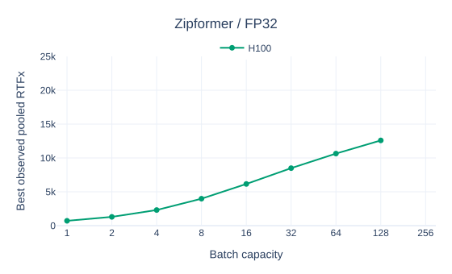
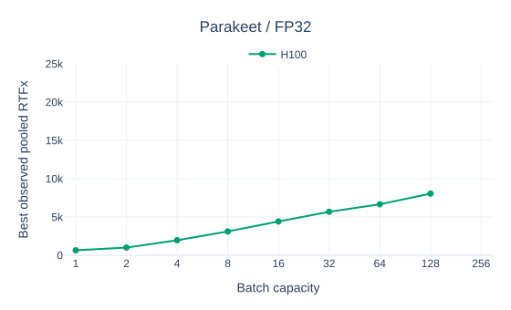
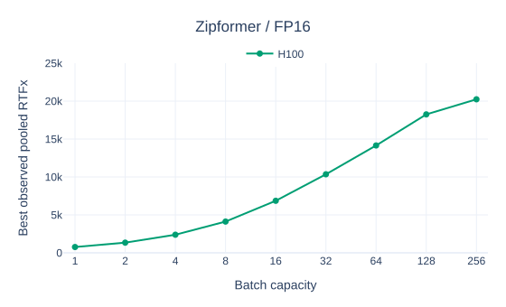
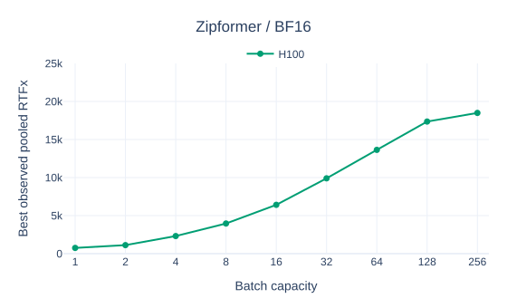
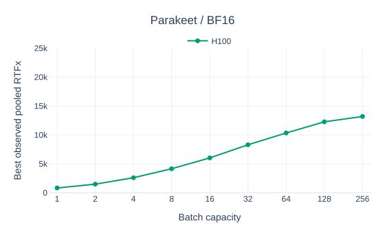

# H100 Benchmark Results

| Zipformer (beam 6) | Parakeet V3 (beam 6) |
|---|---|
|  |  |
|  |  |
|  |  |

Best-observed FP16 results at batch capacity 256 (not medians):

| Model | Batch | Precision | RTFx | Suite time | Mean WER |
|---|---:|---|---:|---:|---:|
| [zipformer](results.md) | 256 | FP16 | 20,242.2 | 28.06 s | 5.244% |
| [parakeet](results.md) | 256 | FP16 | 13,561.8 | 41.88 s | 4.879% |

[Complete results](results.md) | [Methodology and reproduction](methodology.md)
